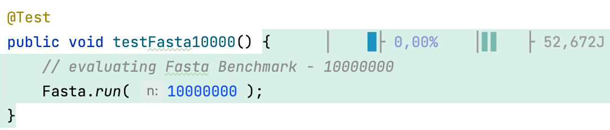

# MANAi - An IntelliJ Plugin for Software Energy Consumption Profiling
[](https://github.com/aschuler84/MANAi/actions/workflows/gradle.yml)

MANAi provides ease of use for energy consumption profiling on Intel-based PCs and Macs.
MANAi leverages *Intel's Running Average Power Limit (RAPL)* to provide feedback to developers
from within Jetbrains Intellij IDEA development tool platform.

Once MANAi is installed and configured correctly, one can execute unit tests in Java projects
using the respective MANAi command runner in IDEA. Recorded samples are mapped to the respective
program unit in the development environment and
energy data is being presented. The following screenshot shows methods that were
executed using MANAi. The color coding gives feedback to the developer on the energy characteristics
of respective methods.



## Motivation
Understanding the energy implications of software design
choices can play a crucial role towards developing
sustainable software. MANAi helps developers, researcher
and students alike to make energy consumption explicit
by providing a wide range of visualisation and tools
for energy-aware development straight within an integrated
development. This way MANAi can support in building awareness
for energy-efficient software design amongst the developer community.

## Getting Started

### Prerequisites
MANAi relies on *Intel's Running Average Power Limit (RAPL)*. Before using MANAi
please ensure that your system supports RAPL.
Currently, MANAi comes in two different flavors, one that supports Intel-based
Macs and the second which offers support from Windows-based systems.

#### Apple Users
The MAC-based version relies on
measurements obtained using an adapted version of the C++ Mozilla RAPL implementation. 
Refer to https://firefox-source-docs.mozilla.org/performance/tools_power_rapl.html
for details on Mozilla RAPL. 

> ⚠️ Be aware, that MANAi only supports Intel-based Mac systems.

#### Windows Users
The Windows version utilizes Intel's Power Gadget which needs to be
installed using the plugin. You can obtain Intel Power Gadget via the following
https://www.intel.com/content/www/us/en/developer/articles/tool/power-gadget.html.
After download, run the installer and test run the power gadget app
to verify that obtaining energy measurements is available on your system.

#### Maven
MANAi uses _Apache Maven_ for communication between an application under test
and the _Intellij_ plugin. In order to properly execute a MANAi test run, ensure
_Apache Maven_ is installed on your system and properly configured.
MANAi processes the `M2_HOME` environment variable, so ensure it is set and pointing
to a valid maven installation directory. The plugin was tested with _Apache Maven 3.8.4_.

Additionally, for MANAi to execute the `mvn` command directly, be sure to update
your PATH-Variable accordingly.

### Installation
MANAi can either be installed and used from one of the published pre-packaged binaries,
or you can build it yourself directly from source (work-in-progress).

#### Installation from Pre-Built Binaries
We provide a set of pre-built binaries which are ready to
use. Just select the correct binary depending on the system
you are working with, download it and install the plugin
using Intellij's internal plugin mechanism.

https://zenodo.org/record/6405335#.YkcC2y-21hE

#### Installation from Source
- ⚠️ Installation from source requires two additional dependencies, which we currently
  do not include in this repository. However, we are working on distributing
  them via Maven central repository in near future.

### Verfiy MANAi Installation
After installing the MANAi plugin upon first startup of the plugin,  
MANAi asks to install dependencies. These dependencies are required
for energy experiment execution and are installed into you local
maven repository which defaults to `~/.m2`.

If the dependency installation fails one reasons might be an invalid 
system configuration might not be valid. To verify if all prerequisists are met
you can open IntelliJ's preferences and proceed to
*Language Tools, Framworks & rarr; MANAi*.
On the MANAi settings page, click the *Verify Installation*
Link. If your configuration is correct, all entries
should show a green checkmark icon.

### Usage

MANAi can be used directly from within your IntelliJ installation.
Once installed, you are able to define new energy experiments
and execute them based on defined unit test methods. To
get you up and running follow the step by step guide
on how to prepare a Java project for MANAi software energy profiling.

#### Project Setup and Preliminaries
MANAi currently only supports maven-managed Java projects.
Therefore, as a preliminary step create a new Maven project from
within IntelliJ which you would like to use as a foundation
for your energy experiments.

- Use whatever project coordinates you like, but ensure to add the following
  dependencies to the project's object model `pom.xml` file

```xml
 <dependencies>
    <!-- this dependency is required for compilation -->
    <dependency>
        <groupId>at.mana</groupId>
        <artifactId>instrument-maven-plugin</artifactId>
        <version>1.0.0</version>
    </dependency>

    <dependency>
        <groupId>junit</groupId>
        <artifactId>junit</artifactId>
        <version>4.13.1</version>
        <scope>test</scope>
    </dependency>
</dependencies>

<build>
    <plugins>
        <!-- this dependency is required for instrumentation -->
        <plugin>
            <groupId>at.mana</groupId>
            <artifactId>instrument-maven-plugin</artifactId>
            <version>1.0.0</version>
            <executions>
                <execution>
                    <goals>
                        <goal>instrument-methods</goal>
                    </goals>
                </execution>
            </executions>
            <configuration>
                <packageList>at</packageList>
            </configuration>
        </plugin>
        <plugin>
            <groupId>org.apache.maven.plugins</groupId>
            <artifactId>maven-compiler-plugin</artifactId>
            <version>3.8.1</version>
        </plugin>

    </plugins>
</build>
```

Otherwise, whenever you open `pom.xml` file without these dependencies, MANAi will provide
a notification that the project is not cappable for software energy
profiling experiments.

>The `<package>` configuration element is required. It lets you restrict search for energy experiment candidate classes residing in the specified package or one of its sub-packages.

Now you should be able to define you first energy experiment:
- Start by creating a unit test.
- Create a new *Run Configuration*, select MANA as configuration type.
- Select sampling interval in milliseconds and the number of collected samples.
- Execute the run configuration - when the experiment run is finished you can inspect recorded energy consumption of execcuted tests right within your source code.

## Conclusion
MANAi provides an out-of-the-box solution
to software energy profiling from within IntelliJ IDE.
We hope that MANAi helps to support in better comprehending
the energy implications of software design choices. If you are
interested in contributing to MANAi or just want to share
your experience using the plugin, feel free to contact me.

Currently, MANAi is primarily tailored to be
used in connection with Java applications.
However its modular design allow to further extend
it to other languages and development environments.

## License
Copyright (c) 2020 the original author or authors. DO NOT ALTER OR REMOVE COPYRIGHT NOTICES.

This Source Code Form is subject to the terms of the Mozilla Public License, v. 2.0. If a copy of the MPL was not distributed with this file, You can obtain one at https://mozilla.org/MPL/2.0/.

## Contributing
We are currently bringing together a contribution guide
which will cover information on how you can contribute to MANAi.
